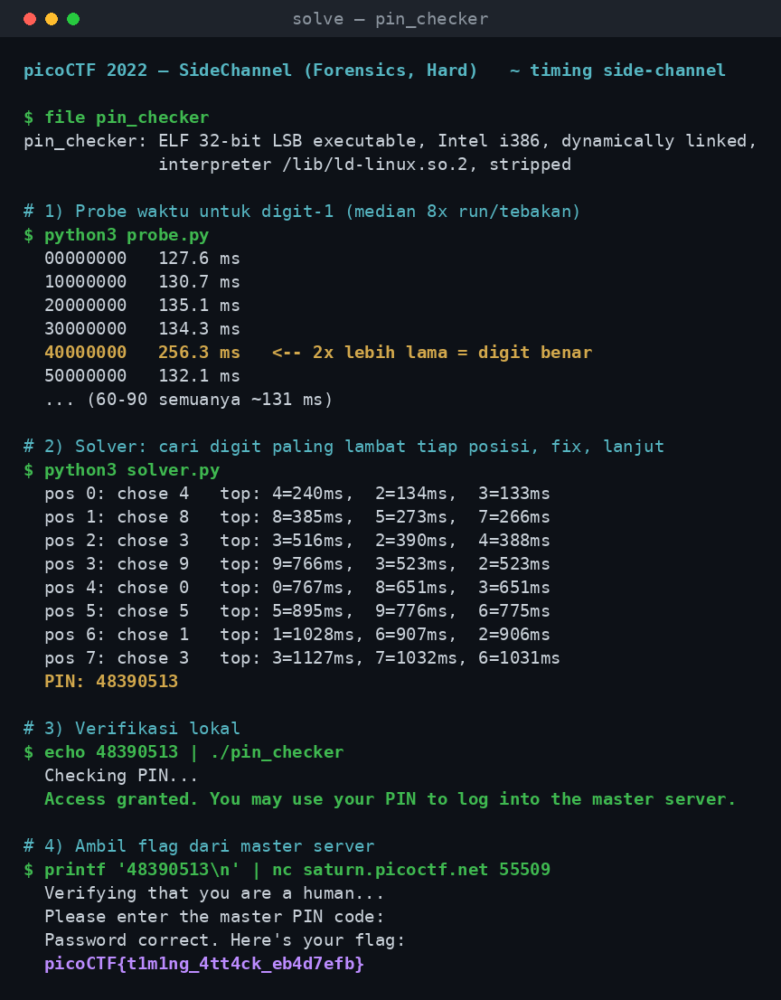

# SideChannel

- **Kategori:** Forensics
- **Kesulitan:** Hard
- **Author:** Anish Singhani
- **Event:** picoCTF 2022
- **Flag:** `picoCTF{t1m1ng_4tt4ck_eb4d7efb}`

> *"There's something fishy about this PIN-code checker, can you figure out the PIN and get the flag? Download the PIN checker program here `pin_checker`. Once you've figured out the PIN (and gotten the checker program to accept it), connect to the master server using `nc saturn.picoctf.net 55509` and provide it the PIN to get your flag."*

Soal ini "Forensics" tapi intinya **timing-based side-channel attack**. Ada binary `pin_checker` yang minta PIN 8 digit. Kita tidak perlu — dan memang **tidak boleh** (Hint 2) — mem-*reverse* binary-nya. PIN dibongkar murni dengan **mengukur berapa lama** program berjalan untuk tiap tebakan: pengecekan PIN-nya bocor lewat waktu.

---

## 1. Ringkasan Solusi (TL;DR)

1. `pin_checker` mengecek PIN **digit demi digit dari kiri**. Untuk **setiap digit prefix yang benar**, program menyelipkan delay (~125 ms) sebelum lanjut. Begitu ketemu digit salah → langsung `Access denied`.
2. Akibatnya **lama eksekusi = jumlah digit awal yang benar**. Prefix 1 benar ≈ 255 ms, 2 benar ≈ 380 ms, dst (tiap digit benar +~125 ms).
3. Serang per posisi: untuk posisi ke-*N*, coba digit `0`–`9` (sisanya isi `0`), ukur median waktunya, **digit paling lambat = digit benar**. Fix, lanjut posisi berikutnya.
4. Biaya cuma `8 × 10 = 80` grup pengukuran, bukan `10^8` brute force.
5. Hasil: **PIN = `48390513`** → binary lokal bilang `Access granted`.
6. Kirim PIN yang sama ke master server (`nc saturn.picoctf.net 55509`) → flag.

⚠️ Hint 3: **jangan** jalankan serangan timing ke master server — dia diamankan terhadap ini. Ukur di **binary lokal** saja; PIN-nya sama.

---

## 2. Recon

```console
$ file pin_checker
pin_checker: ELF 32-bit LSB executable, Intel i386, version 1 (SYSV),
             dynamically linked, interpreter /lib/ld-linux.so.2, stripped

$ ls -l pin_checker
-rwxr-xr-x 8584132 pin_checker      # ~8.5 MB, stripped
```

Binary di-*strip* dan gemuk (~8.5 MB) — sinyal bahwa membedah statis bakal menyakitkan, dan memang tidak perlu. `strings` cukup mengungkap alur interaksinya:

```console
$ strings -n 6 pin_checker | grep -iE 'PIN|Access|Checking'
Please enter your 8-digit PIN code:
Checking PIN...
Access denied.
Access granted. You may use your PIN to log into the master server.
```

Jalankan sekali untuk lihat perilakunya:

```console
$ echo 00000000 | ./pin_checker
Please enter your 8-digit PIN code:
Checking PIN...
Access denied.
```

Tidak ada bocoran di output. Yang membocorkan justru **waktu**.

---

## 3. Analisis — kenapa waktu membocorkan PIN

Ini pola klasik **non-constant-time comparison**. Checker kira-kira begini (model logisnya, bukan hasil disassembly — kita sengaja tidak me-*reverse* sesuai Hint 2):

```c
for (int i = 0; i < 8; i++) {
    if (input[i] != real_pin[i])
        return DENIED;      // keluar begitu ada yang salah
    sleep_a_bit();          // <-- delay per digit yang benar
}
return GRANTED;
```

Karena loop **berhenti di digit salah pertama** dan menyelipkan delay tiap kali sebuah digit **benar**, total waktu berbanding lurus dengan **panjang prefix yang cocok**:

| Prefix benar | Perkiraan waktu |
|--------------|-----------------|
| 0 digit      | ~130 ms (baseline) |
| 1 digit      | ~255 ms |
| 2 digit      | ~380 ms |
| 3 digit      | ~505 ms |
| …            | +~125 ms / digit |

Jadi menebak satu digit tidak butuh tahu isi PIN — cukup tahu **tebakan mana yang membuat program berpikir lebih lama**.

**Bukti sinyalnya nyata.** Probe digit pertama (median 8× run per tebakan), sisanya diisi `0`:

```
00000000   127.6 ms
10000000   130.7 ms
20000000   135.1 ms
30000000   134.3 ms
40000000   256.3 ms   <-- ~2x lebih lama = digit benar
50000000   132.1 ms
60000000 .. 90000000   ~131 ms
```

`4` menonjol tajam (256 ms vs ~130 ms). Berarti digit pertama = `4`. Ulangi logika ini untuk 7 posisi sisanya, setiap kali mengunci prefix yang sudah ketahuan.

> ⚠️ **Kenapa pakai median, bukan satu run?** Scheduler OS, cache, dan startup proses bikin waktu ber-*noise*. Satu run bisa menyesatkan. Median dari beberapa run menstabilkan pembacaan; gap ~125 ms per digit jauh lebih besar dari noise, jadi pemenangnya selalu jelas.

> ⚠️ **Kenapa posisi sisa diisi `0`?** Input harus tetap 8 digit. Isian di belakang posisi yang sedang diuji tidak penting — begitu ada digit salah, loop berhenti di situ. Yang kita ukur cuma efek prefix sampai posisi aktif.

---

## 4. Solusi

Solver menurunkan PIN dari nol (tidak ada jawaban yang di-*hardcode*): untuk tiap posisi, ukur 10 kandidat, ambil yang paling lambat, kunci, lanjut.

```python
LEN = 8
TRIALS = 8  # run per tebakan; median meredam noise

def measure(binary, pin):
    times = []
    for _ in range(TRIALS):
        t0 = time.perf_counter()
        subprocess.run([binary], input=(pin + "\n").encode(),
                       stdout=subprocess.DEVNULL, stderr=subprocess.DEVNULL)
        times.append(time.perf_counter() - t0)
    return statistics.median(times)

def solve(binary):
    known = ""
    for pos in range(LEN):
        best_digit, best_time = None, -1.0
        for d in range(10):
            guess = known + str(d) + "0" * (LEN - pos - 1)
            t = measure(binary, guess)
            if t > best_time:
                best_time, best_digit = t, d
        known += str(best_digit)     # kunci digit paling lambat
    return known
```

Selengkapnya di [`solver.py`](./solver.py). Jalankan:

```console
$ python3 solver.py ./pin_checker
```

Output (median waktu tiap posisi, digit benar hampir selalu ~2× runner-up):

```
pos 0: chose 4   top: 4=240ms,  2=134ms,  3=133ms   -> 4
pos 1: chose 8   top: 8=385ms,  5=273ms,  7=266ms   -> 48
pos 2: chose 3   top: 3=516ms,  2=390ms,  4=388ms   -> 483
pos 3: chose 9   top: 9=766ms,  3=523ms,  2=523ms   -> 4839
pos 4: chose 0   top: 0=767ms,  8=651ms,  3=651ms   -> 48390
pos 5: chose 5   top: 5=895ms,  9=776ms,  6=775ms   -> 483905
pos 6: chose 1   top: 1=1028ms, 6=907ms,  2=906ms   -> 4839051
pos 7: chose 3   top: 3=1127ms, 7=1032ms, 6=1031ms  -> 48390513
```

Perhatikan kolom waktunya **naik terus** tiap posisi — itu delay yang menumpuk karena prefix yang benar makin panjang. Buktinya modelnya benar.

**PIN = `48390513`**

---

## 5. Verifikasi

Binary lokal menerima PIN, lalu master server menukarnya dengan flag:

```console
$ echo 48390513 | ./pin_checker
Checking PIN...
Access granted. You may use your PIN to log into the master server.

$ printf '48390513\n' | nc saturn.picoctf.net 55509
Verifying that you are a human...
Please enter the master PIN code:
Password correct. Here's your flag:
picoCTF{t1m1ng_4tt4ck_eb4d7efb}
```

Rekaman seluruh proses (probe → solver → verifikasi lokal → flag dari server):



**Flag: `picoCTF{t1m1ng_4tt4ck_eb4d7efb}`**

---

## 6. File

| File | Keterangan |
|------|------------|
| [`pin_checker`](./pin_checker) | Binary soal, ELF 32-bit i386 (stripped). Jalankan di Linux/WSL. |
| [`solver.py`](./solver.py) | Solver timing side-channel. Menurunkan PIN dari nol, tanpa hardcode. |
| [`bukti-solve.png`](./bukti-solve.png) | Screenshot bukti solve dari awal sampai flag. |

Cara menjalankan (Linux / WSL, arsitektur x86):

```bash
chmod +x pin_checker
python3 solver.py ./pin_checker          # keluarkan PIN: 48390513
printf '48390513\n' | nc saturn.picoctf.net 55509   # ambil flag
```

> ⚠️ Binary-nya i386. Di sistem 64-bit murni butuh dukungan multilib / library 32-bit (`libc6:i386`). Di WSL biasanya sudah jalan apa adanya.

---

## 7. Catatan / Lessons Learned

- **Timing side-channel = bandingkan waktu, bukan nilai.** Kapan pun sebuah pengecek "keluar lebih awal saat salah" dan "kerja lebih lama saat benar", waktu eksekusinya membocorkan seberapa jauh input kita cocok. Berlaku untuk pengecekan password, MAC, token — bukan cuma PIN.
- **Serangan per posisi mengubah eksponensial jadi linear.** Brute force PIN 8 digit = `10^8`. Dengan oracle timing prefix, tinggal `8 × 10 = 80` grup pengukuran.
- **Median > satu sampel.** Noise timing itu nyata; ambil median/minimum dari beberapa run supaya pemenangnya stabil. Sinyal (~125 ms/digit) harus jauh di atas noise agar andal.
- **Baca hint soal apa adanya.** Hint 2 ("jangan reverse/exploit, cukup ukur properti") langsung menunjuk ke timing. Hint 3 (jangan serang master server) menyelamatkan dari rate-limit/anti-abuse — ukur lokal, submit remote.
- **Delay yang menumpuk = validasi model.** Kalau serangan side-channel benar, waktu absolut tiap posisi harus naik monoton seiring prefix memanjang. Kalau tidak, model timing-nya salah.

---

## 8. Referensi

- picoCTF 2022 — SideChannel (Forensics, Hard), oleh Anish Singhani.
- Konsep: *timing attack* / non-constant-time comparison (mis. `memcmp` yang keluar lebih awal, verifikasi HMAC tanpa `constant_time_compare`).
