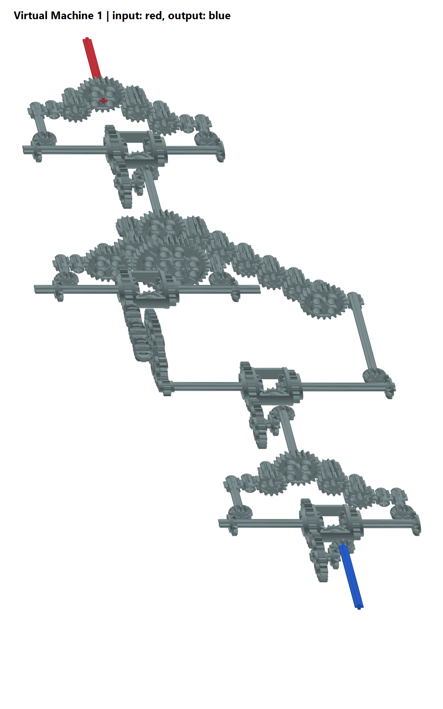

# Virtual Machine 1

- **Kategori:** Reverse Engineering
- **Kesulitan:** Hard
- **Author:** LT 'syreal' Jones
- **Event:** picoCTF 2023
- **Flag:** `picoCTF{m0r3_g34r5_3g4d_4261e7cd}`

> *"The enemy has upgraded their mechanical analog computer. Start an instance to begin."*
>
> *"We grabbed this design doc from enemy servers: Download. We know that the rotation of the red axle is input and the rotation of the blue axle is output. Reverse engineer the mechanism and get past their checker program:"*

```text
nc saturn.picoctf.net 52430
```

Deskripsi lengkap, hints, dan tautan berkas tersimpan di [challenge.md](challenge.md).
Port tersebut adalah port instance saat penyelesaian, bukan alamat permanen.

## 1. Ringkasan Solusi (TL;DR)

1. Ekstrak arsip dan periksa `VirtualMachine1.dae`, sebuah model 3D COLLADA.
2. Identifikasi komponen roda gigi berdasarkan ID LDraw dan posisi porosnya.
3. Sederhanakan rangkaian gear dan empat diferensial menjadi faktor `7`, `191`, dan `7`.
4. Hitung besar rasio akhir: `7 * 191 * 7 = 9359`.
5. Baca input checker, kirim `input * 9359`, lalu ambil flag dari respons server.

## 2. Recon

Unduhan `Virtual-Machine-1.zip` berisi satu file, `VirtualMachine1.dae`,
berukuran 1.317.120 byte. Berkas ini berupa XML, bukan binary program atau
bytecode VM. Potongan metadata aslinya:

```xml
<unit name="LeoCAD" meter="0.0004" />
	<up_axis>Z_UP</up_axis>
```

`library_geometries` mendefinisikan 12 jenis komponen, sedangkan
`library_visual_scenes` menempatkan 127 instance komponen dalam model.
Node ke-2 menggunakan material merah; node ke-120 menggunakan material
biru. Indeks node dalam write-up ini dimulai dari nol.

Koneksi pertama ke checker menghasilkan:

```text
If the input to the machine is 12044, what is the output?
Answer>
```

Artinya, tugasnya menemukan hubungan jumlah putaran poros input dan output.
Tidak ada source code checker dalam arsip; perilakunya diperiksa melalui
service yang disediakan challenge.

## 3. Analisis

### Membaca Model

Posisi setiap komponen tersimpan dalam matriks node. Berikut potongan XML
asli untuk poros merah:

```xml
<matrix>
				0 1 0 135.712
				-1 0 0 -310.354
				0 0 1 33.9119
				0 0 0 1
			</matrix>
```

Node ini mengacu pada geometri `#32073_dat`, yaitu poros. Kolom terakhir
matriks memberikan posisinya. Matriks, ID geometri, dan material digunakan
untuk menelusuri koneksi dari poros merah sampai poros biru.

Gambar berikut dirender dari model yang sama. Struktur penyangga memang
tidak disertakan, sesuai hint soal.



| ID LDraw | Komponen | Jumlah gigi |
| --- | --- | --- |
| 3647 | Gear kecil | 8 |
| 4019 | Gear sedang | 16 |
| 3648b | Gear besar | 24 |
| 32270 | Double bevel gear | 12 |
| 6589 | Bevel gear | 12 |
| 3649 | Gear terbesar | 40 |
| 6573 | Rumah diferensial | 16 dan 24 pada sisi berbeda |

### Aturan Penyederhanaan

Untuk dua gear yang bersinggungan:

```text
besar putaran gear B = besar putaran gear A * gigi_A / gigi_B
```

Gear yang berada pada poros yang sama mempunyai kecepatan putar yang sama.
Gear perantara dengan jumlah gigi sama hanya mengubah arah. Bevel gear
mengubah arah sumbu poros; orientasinya tetap harus dilacak saat dua jalur
bertemu pada diferensial.

Dengan arah poros yang dinyatakan pada acuan yang sama, rumah diferensial
menghasilkan rata-rata kecepatan kedua poros masukannya:

```text
putaran_rumah = (putaran_kiri + putaran_kanan) / 2
```

Jadi, tidak cukup mengalikan semua jumlah gigi yang terlihat. Jalur harus
dipisahkan di percabangan, lalu digabung kembali pada diferensial.

### Bagian Awal: Faktor 7

Misalkan input awal `x`. Setelah menghitung rasio gear dan orientasi bevel,
dua masukan diferensial node 21 memiliki besar putaran:

```text
kiri  = (24/8)  * (16/8)          * x = 6x
kanan = (24/12) * (16/8) * (16/8) * x = 8x
```

Gear perantara 8-ke-8 tidak mengubah besar rasio. Kedua masukan diferensial
searah, sehingga keluarannya `(6x + 8x) / 2 = 7x`.
Pasangan gear 24-ke-24 dan bevel 12-ke-12 berikutnya mempertahankan besar
kecepatan ini. Sebut input bagian tengah sebagai `u = 7x`.

### Bagian Tengah: Faktor 191

Cabang menuju diferensial node 66 menghasilkan:

```text
kiri  = (24/12) * (24/8)  * (24/8) * u = 18u
kanan = (24/12) * (24/12) * (40/8) * u = 20u
rumah diferensial = (18u + 20u) / 2 = 19u
```

Keluaran itu diteruskan melalui rasio 24-ke-12 dan 40-ke-8. Dua pasangan
12-ke-12 di antaranya tidak mengubah besar rasio:

```text
jalur dari diferensial = 19u * (24/12) * (40/8) = 190u
```

Jalur panjang di sisi lain memiliki lima tahap 16-ke-8:

```text
jalur panjang = (24/12) * (16/8)^5 * (24/8) * u
              = 2 * 32 * 3 * u
              = 192u
```

Kedua jalur bertemu pada diferensial node 84. Setelah arah putaran
disamakan acuannya, kedua masukan searah dan menghasilkan:

```text
(190u + 192u) / 2 = 191u
```

### Bagian Akhir: Faktor 7

Bagian akhir mengulang struktur bagian awal. Diferensial node 116
merata-ratakan masukan dengan faktor 6 dan 8, menghasilkan faktor 7 lagi.

```text
rasio keseluruhan = 7 * 191 * 7 = 9359
output checker   = input * 9359
```

## 4. Solusi

[solve.cjs](solve.cjs) menggunakan modul bawaan Node.js, tanpa paket tambahan.
Script membaca angka pertanyaan dari socket, menghitung jawaban dengan
`BigInt`, dan mengirimkannya ke checker. Angka input maupun flag tidak
dihardcode. Rasio `9359` merupakan hasil analisis mekanisme di atas.

Bagian perhitungannya:

```javascript
const ratio = 9359n;
const question = pending.match(/input to the machine is\s+(-?\d+)/i);
const answer = (BigInt(question[1]) * ratio).toString();
socket.write(answer + '\n');
```

Jalankan dari folder ini dengan host dan port instance yang aktif:

```powershell
node .\solve.cjs saturn.picoctf.net 52430
```

Solver menampung potongan data sampai prompt `Answer>` lengkap, sehingga
tidak mengandalkan seluruh pertanyaan datang dalam satu paket TCP.
Flag ditulis ke `flag.txt` hanya setelah muncul dalam respons server.

## 5. Verifikasi

Pada 11 September 2026 sekitar 18:29 WIB, input yang diberikan adalah
`12044`. Jawabannya:

```text
12044 * 9359 = 112719796
```

Respons checker:

```text
If the input to the machine is 12044, what is the output?
Answer> 112719796
112719796
That's correct!
picoCTF{m0r3_g34r5_3g4d_4261e7cd}
```

Baris angka kedua adalah echo dari service. Transkrip lengkap tersedia di
[checker-2026-09-11T11-29-02-688Z.txt](checker-2026-09-11T11-29-02-688Z.txt).

## 6. File

| Berkas | Isi |
| --- | --- |
| [challenge.md](challenge.md) | Deskripsi asli, kategori, author, dan hints |
| [Virtual-Machine-1.zip](Virtual-Machine-1.zip) | Arsip unduhan asli |
| [VirtualMachine1.dae](VirtualMachine1.dae) | Model 3D hasil ekstraksi |
| [solve.cjs](solve.cjs) | Solver checker berbasis Node.js |
| [render-model.ps1](render-model.ps1) | Renderer model menjadi PNG di Windows |
| [machine.png](machine.png) | Gambar mekanisme dari model asli |
| [flag.txt](flag.txt) | Flag yang dikirim checker |
| [checker-2026-09-11T11-29-02-688Z.txt](checker-2026-09-11T11-29-02-688Z.txt) | Transkrip percobaan yang berhasil |
| [checker-transcript.txt](checker-transcript.txt) | Transkrip percobaan awal yang ditolak |
| [ANALYSIS.md](ANALYSIS.md) | Catatan analisis saat penyelesaian |

Untuk membuat ulang gambar di Windows, jalankan `render-model.ps1` melalui
PowerShell pada lingkungan yang mengizinkan skrip lokal.

## 7. Catatan / Lessons Learned

- **Jebakan tanda putaran:** percobaan awal memakai `-9359`, menghasilkan
  `-112719796`, dan ditolak. Checker menerima besar rasio positif. Arah
  putaran terhadap sumbu koordinat model tidak langsung menentukan tanda
  angka yang diminta service.
- **Jeda setelah salah:** checker memberikan cooldown 360 detik. Setelah
  memperbaiki tanda dan menunggu jeda selesai, jawaban positif diterima.
- **Diferensial bukan gear biasa:** dua jalur masuk harus dihitung terpisah
  dan dirata-ratakan, bukan sekadar dikalikan sepanjang semua komponen.
- **Geometri adalah petunjuk:** gunakan ID komponen, matriks, dan jumlah
  gigi untuk menyederhanakan mesin. Sesuai hint, tumpang tindih gigi pada
  model tidak perlu disimulasikan sebagai benturan fisik.

## 8. Referensi

- [Katalog LDraw: gear 8 gigi (3647)](https://library.ldraw.org/parts/6669)
- [Katalog LDraw: gear 16 gigi (4019)](https://library.ldraw.org/parts/list?tableSearch=4019.dat)
- [Katalog LDraw: double bevel 12 gigi (32270)](https://library.ldraw.org/parts/5668)
- [Katalog LDraw: diferensial 6573](https://library.ldraw.org/parts/list?tableSearch=6573.dat)
- [Write-up pembanding, bagian Virtual Machine 1](https://github.com/4C-75-63-6B-79/picoCTF_2023#virtual-machine-1)

Perhitungan mekanisme dilakukan dari berkas lokal. Write-up pembanding
dipakai untuk memeriksa rasio positif setelah percobaan negatif ditolak.
Flag di atas berasal dari verifikasi langsung terhadap instance, bukan
dari flag yang tercantum di referensi.
